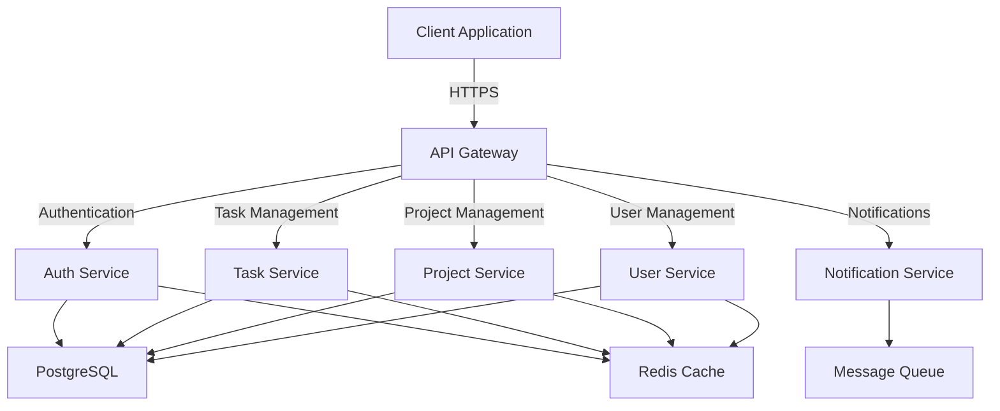

# Task Management System

[](https://github.com/task-management-system/task-management-system/actions)
[](https://codecov.io/gh/task-management-system/task-management-system)
[](LICENSE)
[](package.json)

A comprehensive enterprise-grade task management system designed for modern workplaces, featuring real-time collaboration, advanced project tracking, and robust security measures.

## Features

- 🚀 Real-time task collaboration and updates
- 📊 Advanced project visualization and reporting
- 🔒 Enterprise-grade security with role-based access
- 🔄 Seamless integration capabilities
- 📱 Responsive design for all devices
- 🌐 Multi-language support
- 📈 Performance analytics and insights

## System Architecture



## Prerequisites

- Node.js >= 20.0.0
- npm >= 9.0.0
- PostgreSQL 14+
- Redis 7+
- Docker & Docker Compose

## Getting Started

### Installation

1. Clone the repository:
```bash
git clone https://github.com/task-management-system/task-management-system.git
cd task-management-system
```

2. Install dependencies:
```bash
# Backend dependencies
cd src/backend
npm ci

# Frontend dependencies
cd ../web
npm ci
```

3. Configure environment variables:
```bash
# Backend configuration
cp src/backend/.env.example src/backend/.env

# Frontend configuration
cp src/web/.env.example src/web/.env
```

4. Initialize the database:
```bash
cd src/backend
npm run prisma:migrate
npm run prisma:generate
```

### Development

Start the development servers:

```bash
# Backend development server
cd src/backend
npm run dev

# Frontend development server
cd src/web
npm run dev
```

### Testing

```bash
# Backend tests
cd src/backend
npm run test:coverage

# Frontend tests
cd src/web
npm run test:coverage

# E2E tests
cd src/web
npm run test:e2e
```

## Project Structure

```
task-management-system/
├── src/
│   ├── backend/           # Backend microservices
│   │   ├── src/          # Source code
│   │   ├── tests/        # Test files
│   │   └── prisma/       # Database schema and migrations
│   └── web/              # Frontend application
│       ├── src/          # Source code
│       └── tests/        # Test files
├── docs/                 # Documentation
├── .github/              # GitHub configuration
└── docker/              # Docker configuration
```

## Development Guidelines

Please refer to [CONTRIBUTING.md](CONTRIBUTING.md) for detailed development guidelines, including:

- Code style and standards
- Git workflow
- Testing requirements
- Security guidelines
- Performance optimization
- Pull request process

## Deployment

### Production Build

```bash
# Build backend
cd src/backend
npm run build

# Build frontend
cd src/web
npm run build
```

### Docker Deployment

```bash
# Build and start all services
docker-compose up -d

# Scale specific services
docker-compose up -d --scale task-service=3
```

## Security

- JWT-based authentication
- Role-based access control (RBAC)
- Data encryption at rest and in transit
- Regular security audits and updates
- Comprehensive input validation
- Rate limiting and DDoS protection

## Performance

- Redis caching layer
- Database query optimization
- CDN integration for static assets
- Lazy loading and code splitting
- Performance monitoring and alerts

## API Documentation

API documentation is available at `/api/docs` when running the development server. It includes:

- Endpoint specifications
- Request/response examples
- Authentication details
- Rate limiting information

## Contributing

We welcome contributions! Please see our [Contributing Guidelines](CONTRIBUTING.md) for details on:

- Code of Conduct
- Development workflow
- Pull request process
- Testing requirements

## Support

- GitHub Issues: Bug reports and feature requests
- Documentation: Comprehensive guides and API references
- Security: Report vulnerabilities to security@taskmanagement.com

## License

This project is licensed under the MIT License - see the [LICENSE](LICENSE) file for details.

Copyright (c) 2023 Task Management System