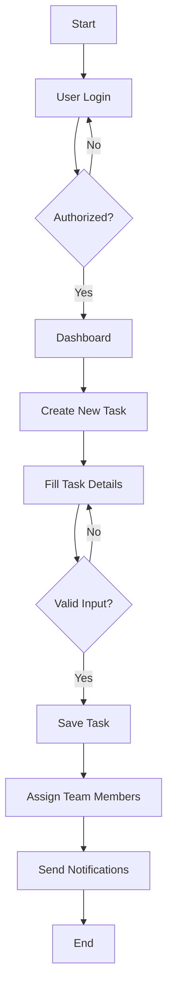
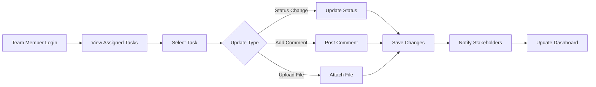
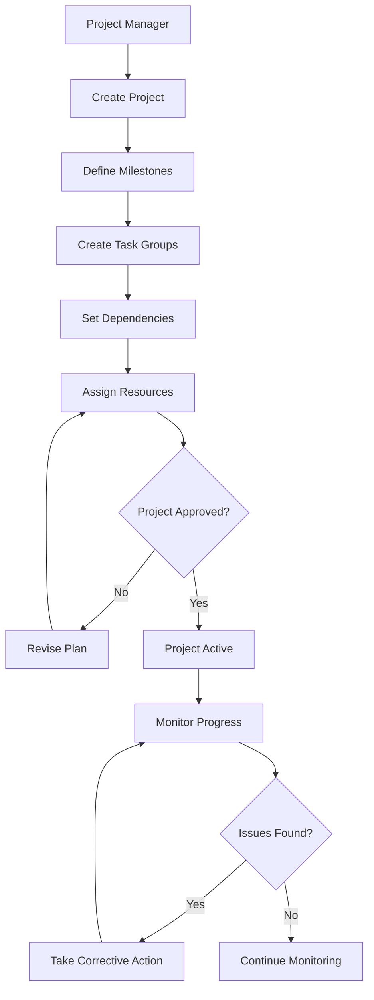
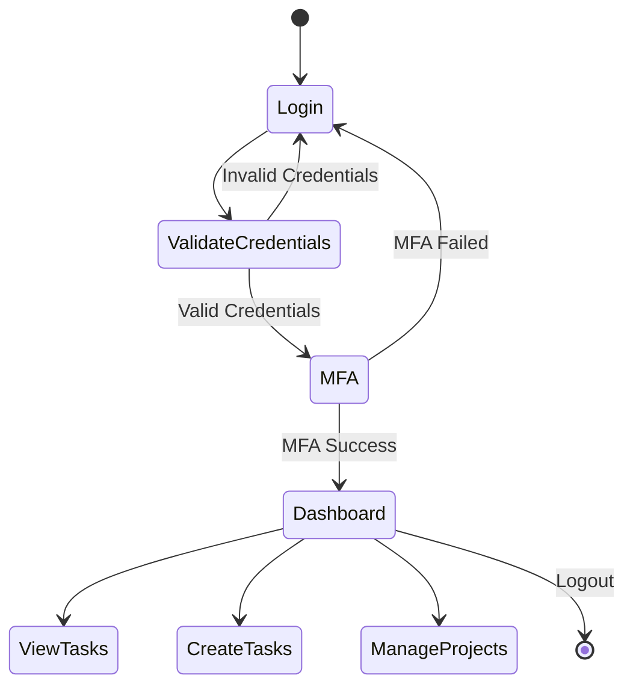
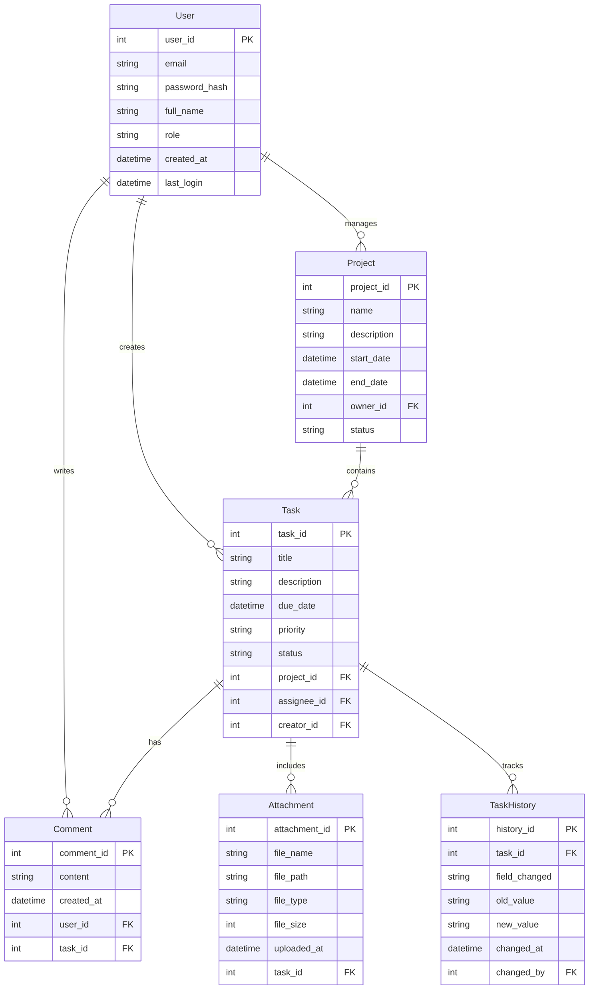
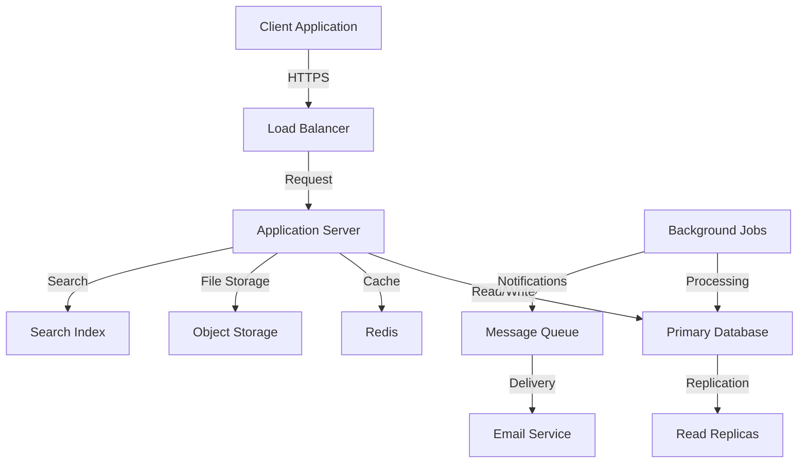

# Product Requirements Document (PRD)

# 1. INTRODUCTION

## 1.1 Purpose

This Software Requirements Specification (SRS) document provides a comprehensive description of the Task Management System. It details the functional and non-functional requirements for the development team, project stakeholders, and quality assurance team. The document serves as the primary reference for technical and non-technical audiences to understand the system's intended behavior, constraints, and performance expectations.

Go to next line...

## 1.2 Scope

The Task Management System is a web-based application designed to streamline task organization and team collaboration. The system encompasses:

- Task Creation and Management

  - Create, edit, and delete tasks
  - Assign due dates, priorities, and team members
  - Track task status and progress
  - Attach files and documents

- Project Organization

  - Categorize tasks into projects
  - Set project hierarchies and dependencies
  - Monitor project timelines and milestones

- Team Collaboration

  - Real-time updates and notifications
  - Comment threads on tasks
  - File sharing capabilities
  - Team member availability tracking

- Access Control

  - Role-based permissions (Admin, Manager, Team Member)
  - User authentication and authorization
  - Secure data access

- Reporting and Analytics

  - Task completion metrics
  - Team productivity reports
  - Project progress tracking
  - Custom dashboard views

The system will improve team efficiency, enhance communication, and provide clear visibility into project progress while maintaining data security and user privacy.

# 2. PRODUCT DESCRIPTION

## 2.1 Product Perspective

The Task Management System operates as a standalone web application while integrating with existing enterprise infrastructure:

- Deployment Environment

  - Cloud-based architecture
  - Web browsers as primary client interface
  - Mobile-responsive design for cross-device accessibility

- System Interfaces

  - RESTful API for third-party integrations
  - Email server integration for notifications
  - Cloud storage services for file attachments
  - Single Sign-On (SSO) compatibility

- User Interfaces

  - Modern web interface with responsive design
  - Command-line interface for administrative functions
  - API endpoints for programmatic access

## 2.2 Product Functions

The system provides the following core functionalities:

| Function Category | Key Features |
| --- | --- |
| Task Management | - Task creation and modification - Priority and status tracking - Due date management - Task dependencies - File attachments |
| Project Organization | - Project hierarchy creation - Milestone tracking - Resource allocation - Timeline visualization |
| Team Collaboration | - Real-time updates - Comment threading - @mentions and notifications - Shared workspaces |
| Reporting | - Progress tracking - Performance analytics - Custom report generation - Data export capabilities |
| Administration | - User management - Permission control - System configuration - Audit logging |

## 2.3 User Characteristics

### Administrator

- Technical expertise: High
- System knowledge: Complete understanding of system configuration
- Responsibilities: User management, system maintenance, security oversight

### Project Manager

- Technical expertise: Moderate
- System knowledge: Proficient in project management features
- Responsibilities: Project planning, resource allocation, timeline management

### Team Member

- Technical expertise: Basic to Moderate
- System knowledge: Familiar with task management features
- Responsibilities: Task execution, updates, collaboration

### Client/Stakeholder

- Technical expertise: Basic
- System knowledge: Limited to viewing and commenting
- Responsibilities: Project monitoring, feedback provision

## 2.4 Constraints

### Technical Constraints

- Browser compatibility: Must support latest versions of Chrome, Firefox, Safari, and Edge
- Maximum file attachment size: 25MB per file
- Response time: \< 2 seconds for standard operations
- Concurrent users: Support for up to 1000 simultaneous users

### Business Constraints

- Budget limitations for third-party services
- Compliance with GDPR and CCPA regulations
- Implementation timeline of 6 months
- Regular maintenance windows required

### Security Constraints

- Data encryption at rest and in transit
- Multi-factor authentication requirement
- Regular security audits
- Password policy enforcement

## 2.5 Assumptions and Dependencies

### Assumptions

- Users have stable internet connectivity
- Basic computer literacy among all users
- Email service availability for notifications
- Modern web browser access

### Dependencies

- Cloud infrastructure availability
- Third-party authentication services
- Email delivery services
- Database management system
- Content delivery network (CDN)
- Browser compatibility with modern web standards

# 3. PROCESS FLOWCHART

## 3.1 Task Creation and Assignment Flow

## 3.2 Task Update Workflow

## 3.3 Project Management Flow

## 3.4 User Authentication Flow

# 4. FUNCTIONAL REQUIREMENTS

## 4.1 User Management

### ID: F-UM-01

### Description

User registration, authentication, and profile management functionality

### Priority

High

### Requirements

| ID | Requirement | Priority |
| --- | --- | --- |
| F-UM-01.1 | System shall support user registration with email verification | High |
| F-UM-01.2 | System shall implement SSO authentication | High |
| F-UM-01.3 | Users shall be able to reset passwords via email | High |
| F-UM-01.4 | Users shall be able to update profile information | Medium |
| F-UM-01.5 | System shall support role-based access control | High |

## 4.2 Task Management

### ID: F-TM-01

### Description

Core task creation, editing, and tracking functionality

### Priority

High

### Requirements

| ID | Requirement | Priority |
| --- | --- | --- |
| F-TM-01.1 | Users shall be able to create tasks with title, description, due date | High |
| F-TM-01.2 | Users shall be able to assign tasks to team members | High |
| F-TM-01.3 | System shall support task priority levels (Low, Medium, High) | High |
| F-TM-01.4 | Users shall be able to attach files up to 25MB per task | Medium |
| F-TM-01.5 | System shall track task status changes | High |

## 4.3 Project Management

### ID: F-PM-01

### Description

Project organization and hierarchy management functionality

### Priority

High

### Requirements

| ID | Requirement | Priority |
| --- | --- | --- |
| F-PM-01.1 | Users shall be able to create and organize projects | High |
| F-PM-01.2 | System shall support project milestone creation | Medium |
| F-PM-01.3 | Users shall be able to set task dependencies | Medium |
| F-PM-01.4 | System shall provide project timeline visualization | Medium |
| F-PM-01.5 | Users shall be able to set project access permissions | High |

## 4.4 Collaboration

### ID: F-CO-01

### Description

Team communication and collaboration features

### Priority

High

### Requirements

| ID | Requirement | Priority |
| --- | --- | --- |
| F-CO-01.1 | Users shall be able to comment on tasks | High |
| F-CO-01.2 | System shall support @mentions in comments | Medium |
| F-CO-01.3 | System shall provide real-time notifications | High |
| F-CO-01.4 | Users shall be able to share files within comments | Medium |
| F-CO-01.5 | System shall support team member availability status | Low |

## 4.5 Reporting and Analytics

### ID: F-RA-01

### Description

Data visualization and reporting functionality

### Priority

Medium

### Requirements

| ID | Requirement | Priority |
| --- | --- | --- |
| F-RA-01.1 | System shall generate task completion reports | Medium |
| F-RA-01.2 | Users shall be able to view team productivity metrics | Medium |
| F-RA-01.3 | System shall provide customizable dashboard views | Medium |
| F-RA-01.4 | System shall support data export in CSV format | Low |
| F-RA-01.5 | System shall track and display project progress | High |

# 5. NON-FUNCTIONAL REQUIREMENTS

## 5.1 Performance

| Requirement ID | Description | Target Metric |
| --- | --- | --- |
| NF-P-01 | Page Load Time | Initial page load \< 3 seconds |
| NF-P-02 | API Response Time | 95% of requests \< 500ms |
| NF-P-03 | Database Query Performance | 99% of queries \< 100ms |
| NF-P-04 | Concurrent Users | Support 1000 simultaneous users |
| NF-P-05 | File Upload Speed | Process 25MB file upload \< 30 seconds |
| NF-P-06 | Real-time Updates | Notification delivery \< 2 seconds |

## 5.2 Safety

| Requirement ID | Description | Implementation |
| --- | --- | --- |
| NF-S-01 | Data Backup | Automated daily backups with 30-day retention |
| NF-S-02 | Disaster Recovery | Recovery Time Objective (RTO) \< 4 hours |
| NF-S-03 | Data Loss Prevention | Recovery Point Objective (RPO) \< 1 hour |
| NF-S-04 | System Monitoring | 24/7 automated system health monitoring |
| NF-S-05 | Failover Capability | Automatic failover to backup systems |

## 5.3 Security

| Requirement ID | Description | Specification |
| --- | --- | --- |
| NF-SE-01 | Authentication | Multi-factor authentication support |
| NF-SE-02 | Authorization | Role-based access control (RBAC) |
| NF-SE-03 | Data Encryption | AES-256 encryption at rest and in transit |
| NF-SE-04 | Session Management | Automatic session timeout after 30 minutes |
| NF-SE-05 | Password Policy | Minimum 12 characters with complexity requirements |
| NF-SE-06 | Audit Logging | Complete audit trail of all system actions |

## 5.4 Quality

### 5.4.1 Availability

- System uptime: 99.9% excluding planned maintenance
- Planned maintenance windows: Monthly, \< 4 hours during off-peak
- Maximum unplanned downtime: 1 hour per month

### 5.4.2 Maintainability

- Modular architecture for easy component updates
- Automated deployment processes
- Comprehensive system documentation
- Code coverage minimum 80%

### 5.4.3 Usability

- Intuitive interface requiring \< 2 hours training
- Support for multiple languages
- Accessibility compliance with WCAG 2.1 Level AA
- Mobile-responsive design for all features

### 5.4.4 Scalability

- Horizontal scaling capability
- Auto-scaling based on load metrics
- Database partitioning support
- CDN integration for static content

### 5.4.5 Reliability

- Mean Time Between Failures (MTBF): \> 720 hours
- Mean Time To Recovery (MTTR): \< 1 hour
- Error rate: \< 0.1% of all transactions
- Data integrity verification systems

## 5.5 Compliance

| Requirement ID | Description | Standard/Regulation |
| --- | --- | --- |
| NF-C-01 | Data Privacy | GDPR, CCPA compliance |
| NF-C-02 | Data Storage | Regional data residency requirements |
| NF-C-03 | Accessibility | WCAG 2.1 Level AA compliance |
| NF-C-04 | Security Standards | ISO 27001 compliance |
| NF-C-05 | Industry Standards | REST API standards compliance |
| NF-C-06 | Documentation | API documentation in OpenAPI 3.0 format |

# 6. DATA REQUIREMENTS

## 6.1 Data Models

## 6.2 Data Storage

### 6.2.1 Database Requirements

- Primary Database: PostgreSQL 14+ for structured data
- Document Store: MongoDB for unstructured data (comments, attachments)
- Cache Layer: Redis for session management and real-time updates

### 6.2.2 Data Retention

- Active Data: Indefinite retention for all active projects and tasks
- Archived Data: 3 years retention after project completion
- Audit Logs: 7 years retention
- System Logs: 90 days retention
- Session Data: 24 hours retention

### 6.2.3 Backup and Recovery

- Full Database Backup: Daily
- Incremental Backups: Every 6 hours
- Point-in-time Recovery: Supported up to 30 days
- Backup Storage: Geo-redundant cloud storage
- Recovery Time Objective (RTO): 4 hours
- Recovery Point Objective (RPO): 1 hour

### 6.2.4 Data Redundancy

- Database Replication: Master-slave configuration with 3 replicas
- Geographic Distribution: Multi-region deployment
- Data Sharding: Based on project_id for horizontal scaling
- Failover: Automated with maximum 5-minute detection and switch

## 6.3 Data Processing

### 6.3.1 Data Flow

### 6.3.2 Data Security

- Encryption at Rest: AES-256 encryption for all stored data
- Encryption in Transit: TLS 1.3 for all data transmission
- Data Masking: PII and sensitive data masked in logs and reports
- Access Control: Row-level security implemented in database
- Data Classification:
  - Public: Project names, task titles
  - Internal: Task descriptions, comments
  - Confidential: User data, attachments
  - Restricted: Authentication credentials

### 6.3.3 Data Validation

- Input Validation: Server-side validation for all user inputs
- Data Integrity: Foreign key constraints and triggers
- Data Format: JSON schema validation for API payloads
- File Validation:
  - Maximum file size: 25MB
  - Allowed formats: PDF, DOC, DOCX, XLS, XLSX, JPG, PNG
  - Virus scanning before storage

### 6.3.4 Data Migration

- Support for bulk data import/export
- Version control for database schema changes
- Migration rollback capabilities
- Zero-downtime migration support
- Data transformation utilities for legacy system integration

# 7. EXTERNAL INTERFACES

## 7.1 User Interfaces

### 7.1.1 Web Application Interface

- Responsive design supporting viewport sizes from 320px to 4K displays
- Material Design 3 component library implementation
- Minimum clickable area of 44x44 pixels for touch targets
- Color contrast ratio compliance with WCAG 2.1 Level AA (4.5:1)

### 7.1.2 Key Interface Components

| Component | Requirements |
| --- | --- |
| Navigation | - Persistent top navigation bar - Collapsible side menu for project hierarchy - Breadcrumb navigation for deep pages |
| Dashboard | - Customizable widget layout - Drag-and-drop task organization - Real-time status updates - Progress visualization |
| Task Views | - List and Kanban board views - Calendar integration - Gantt chart for timeline visualization |
| Forms | - Inline editing capability - Auto-save functionality - Form validation feedback - Progressive disclosure of complex options |

### 7.1.3 Mobile Interface

- Progressive Web App (PWA) implementation
- Touch-optimized controls
- Offline capability for basic task management
- Native-like animations and transitions

## 7.2 Hardware Interfaces

### 7.2.1 Client Devices

- Minimum display resolution: 320x568 pixels
- Input devices: Touch screen, mouse, keyboard
- Camera access for document scanning and attachments
- Local storage requirements: 50MB minimum

### 7.2.2 Server Infrastructure

- Load balancer interface specifications
- Storage system connectivity requirements
- Network interface requirements: 10Gbps minimum
- Backup system interface requirements

## 7.3 Software Interfaces

### 7.3.1 External Services Integration

| Service Type | Interface Specification |
| --- | --- |
| Email Service | - SMTP/REST API integration - OAuth 2.0 authentication - Support for HTML email templates |
| File Storage | - S3-compatible API - Multi-part upload support - CDN integration |
| Authentication | - OpenID Connect protocol - SAML 2.0 support - JWT token handling |
| Calendar | - CalDAV protocol support - iCal format compatibility |

### 7.3.2 Database Interfaces

- PostgreSQL: TCP/IP connection, port 5432
- MongoDB: TCP/IP connection, port 27017
- Redis: TCP/IP connection, port 6379
- Connection pooling configuration
- Prepared statement support

## 7.4 Communication Interfaces

### 7.4.1 Network Protocols

- HTTPS (TLS 1.3) for all client-server communication
- WebSocket protocol for real-time updates
- HTTP/2 support for improved performance
- gRPC for internal service communication

### 7.4.2 API Specifications

| API Type | Specification |
| --- | --- |
| REST API | - OpenAPI 3.0 documentation - JSON payload format - Rate limiting: 1000 requests/hour - Pagination support |
| WebSocket | - Socket.io implementation - Binary message support - Auto-reconnection handling - Event-based communication |
| GraphQL | - Schema-first design - Query complexity limits - Subscription support for real-time data |

### 7.4.3 Integration Patterns

- Webhook support for external notifications
- Message queue interface using RabbitMQ
- Event-driven architecture using Apache Kafka
- ETL interfaces for reporting systems

### 7.4.4 Data Formats

- JSON for API responses
- Protocol Buffers for internal communication
- CSV/Excel for data export
- XML for legacy system integration

# 8. APPENDICES

## 8.1 GLOSSARY

| Term | Definition |
| --- | --- |
| Assignee | User who is responsible for completing a task |
| Dashboard | Customizable interface showing task and project status overview |
| Kanban Board | Visual task management tool organizing items in columns by status |
| Milestone | Significant checkpoint or goal within a project timeline |
| Role-Based Access Control | System for controlling access based on user roles |
| Sprint | Fixed time period for completing a set of tasks |
| Task Dependency | Relationship where one task must be completed before another can start |
| Webhook | Automated message sent from the system to external applications when events occur |
| Workspace | Dedicated area within the system for a team or project |

## 8.2 ACRONYMS

| Acronym | Definition |
| --- | --- |
| API | Application Programming Interface |
| CCPA | California Consumer Privacy Act |
| CDN | Content Delivery Network |
| CSV | Comma-Separated Values |
| GDPR | General Data Protection Regulation |
| JWT | JSON Web Token |
| MFA | Multi-Factor Authentication |
| MTBF | Mean Time Between Failures |
| MTTR | Mean Time To Recovery |
| PII | Personally Identifiable Information |
| PWA | Progressive Web Application |
| RBAC | Role-Based Access Control |
| REST | Representational State Transfer |
| RPO | Recovery Point Objective |
| RTO | Recovery Time Objective |
| SAML | Security Assertion Markup Language |
| SLA | Service Level Agreement |
| SSO | Single Sign-On |
| TLS | Transport Layer Security |
| WCAG | Web Content Accessibility Guidelines |

## 8.3 ADDITIONAL REFERENCES

| Reference | Description | URL |
| --- | --- | --- |
| Material Design 3 | UI component design system | https://m3.material.io/ |
| OpenAPI Specification | REST API documentation standard | https://www.openapis.org/ |
| PostgreSQL Documentation | Database reference | https://www.postgresql.org/docs/ |
| Redis Documentation | Cache system reference | https://redis.io/documentation |
| Socket.io Documentation | WebSocket implementation guide | https://socket.io/docs/ |
| WCAG 2.1 Guidelines | Web accessibility standards | https://www.w3.org/WAI/WCAG21/Understanding/ |