# Technical Specifications

# 1. INTRODUCTION

## 1.1 EXECUTIVE SUMMARY

The Task Management System is a comprehensive web-based solution designed to streamline task organization and enhance team collaboration in modern workplaces. This system addresses the critical business challenge of fragmented task management and inefficient team coordination by providing a centralized platform for creating, tracking, and completing tasks across projects and teams.

The solution targets organizations seeking to improve productivity and project visibility, serving stakeholders from executive management to individual contributors. By implementing this system, organizations can expect reduced task completion times, improved team coordination, and enhanced project transparency, ultimately leading to increased operational efficiency and better resource utilization.

## 1.2 SYSTEM OVERVIEW

### Project Context

| Aspect | Description |
|--------|-------------|
| Market Position | Enterprise-grade task management solution positioned between simple to-do apps and complex project management systems |
| Current Limitations | Existing solutions lack real-time collaboration, have limited integration capabilities, and insufficient reporting features |
| Enterprise Integration | Seamlessly connects with corporate email systems, authentication services, and storage solutions |

### High-Level Description

| Component | Details |
|-----------|----------|
| Core Architecture | Cloud-native, microservices-based architecture with RESTful APIs |
| Technical Stack | Modern web technologies, containerized services, distributed database system |
| Major Components | Task Engine, Project Management Module, Collaboration Hub, Analytics Engine |
| Security Framework | Enterprise-grade security with role-based access control and encryption |

### Success Criteria

| Category | Metrics |
|----------|---------|
| Performance | - Page load time < 3 seconds<br>- API response time < 500ms<br>- 99.9% system uptime |
| Adoption | - 80% user adoption within 3 months<br>- 90% task tracking through system |
| Efficiency | - 30% reduction in task completion time<br>- 50% reduction in status update meetings |
| User Satisfaction | - User satisfaction score > 4.0/5.0<br>- Support ticket volume < 100/month |

## 1.3 SCOPE

### In-Scope Elements

#### Core Features and Functionalities

| Feature Category | Included Capabilities |
|-----------------|----------------------|
| Task Management | - Task creation and assignment<br>- Priority and status tracking<br>- Due date management<br>- File attachments |
| Project Organization | - Project hierarchy management<br>- Timeline visualization<br>- Resource allocation<br>- Milestone tracking |
| Collaboration | - Real-time updates<br>- Comment threads<br>- @mentions<br>- File sharing |
| Reporting | - Performance analytics<br>- Progress tracking<br>- Custom dashboards<br>- Export capabilities |

#### Implementation Boundaries

| Boundary Type | Coverage |
|--------------|----------|
| User Groups | - System Administrators<br>- Project Managers<br>- Team Members<br>- Stakeholders |
| Geographic Scope | - Global deployment<br>- Multi-language support<br>- Regional data compliance |
| Data Domains | - Project data<br>- User information<br>- Task records<br>- Activity logs |

### Out-of-Scope Elements

| Category | Excluded Elements |
|----------|------------------|
| Features | - Advanced resource management<br>- Financial tracking<br>- Time tracking<br>- Customer relationship management |
| Integrations | - Legacy system migration tools<br>- Custom API development<br>- Third-party marketplace<br>- Mobile native apps |
| Future Considerations | - AI-powered task automation<br>- Advanced analytics<br>- Custom workflow builder<br>- Integrated video conferencing |

# 2. SYSTEM ARCHITECTURE

## 2.1 High-Level Architecture

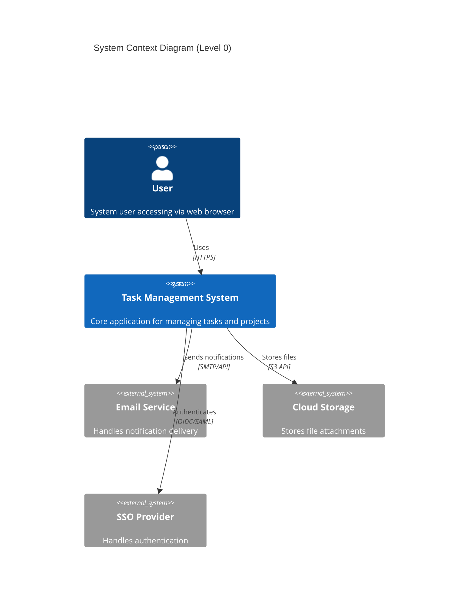

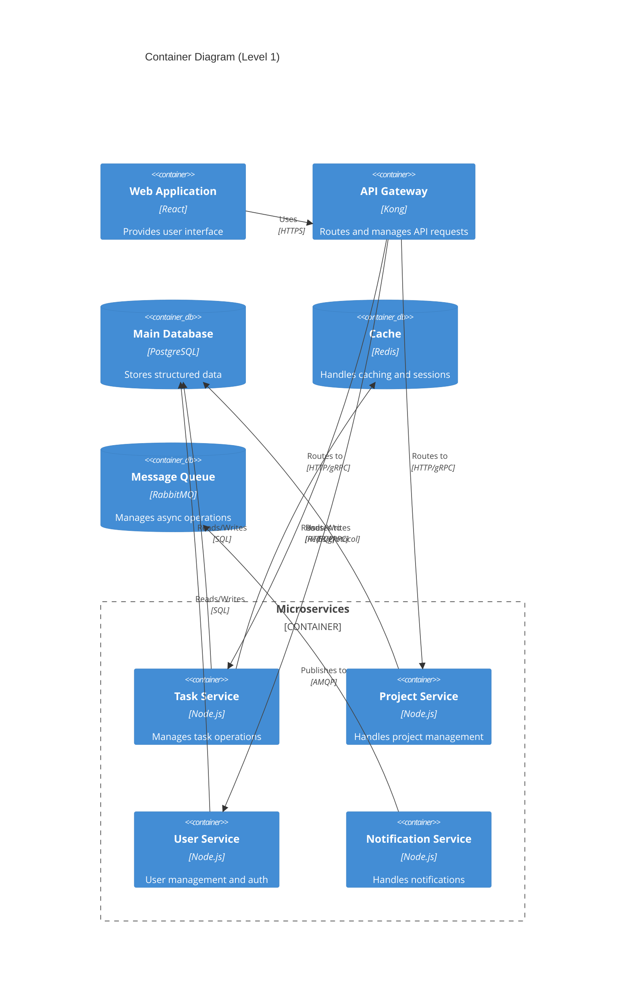

## 2.2 Component Details

### 2.2.1 Core Components

| Component | Purpose | Technology Stack | Scaling Strategy |
|-----------|---------|-----------------|------------------|
| Web Frontend | User interface delivery | React, Redux, Material-UI | Horizontal scaling with CDN |
| API Gateway | Request routing, rate limiting | Kong Gateway | Horizontal scaling with load balancer |
| Task Service | Task CRUD operations | Node.js, Express | Horizontal scaling with container orchestration |
| Project Service | Project management | Node.js, Express | Horizontal scaling with container orchestration |
| User Service | Authentication, user management | Node.js, Express | Horizontal scaling with container orchestration |
| Notification Service | Message delivery | Node.js, Express | Horizontal scaling with queue-based processing |

### 2.2.2 Data Storage Components

| Component | Purpose | Technology | Scaling Strategy |
|-----------|---------|------------|------------------|
| Main Database | Primary data storage | PostgreSQL 14 | Master-slave replication |
| Cache Layer | Performance optimization | Redis Cluster | Distributed caching |
| Message Queue | Async processing | RabbitMQ | Clustered deployment |
| File Storage | Document management | S3-compatible storage | Built-in distributed storage |

## 2.3 Technical Decisions

### 2.3.1 Architecture Patterns

| Pattern | Implementation | Justification |
|---------|---------------|---------------|
| Microservices | Domain-driven service boundaries | Enables independent scaling and deployment |
| Event-Driven | RabbitMQ message broker | Decouples services and ensures reliability |
| CQRS | Separate read/write models | Optimizes for different access patterns |
| API Gateway | Kong Gateway | Centralizes cross-cutting concerns |

### 2.3.2 Data Management

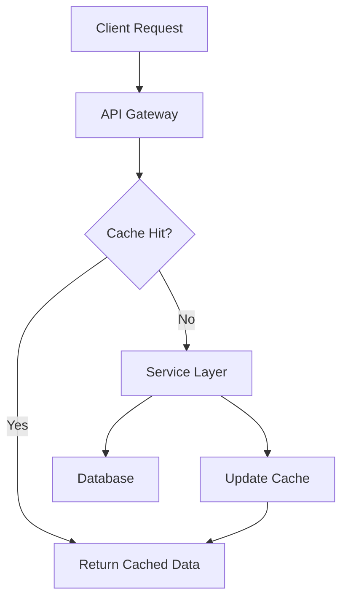

## 2.4 Cross-Cutting Concerns

### 2.4.1 Monitoring and Observability

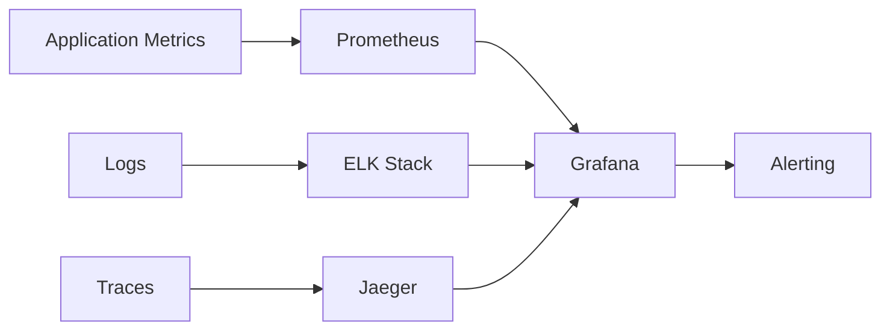

### 2.4.2 Security Architecture

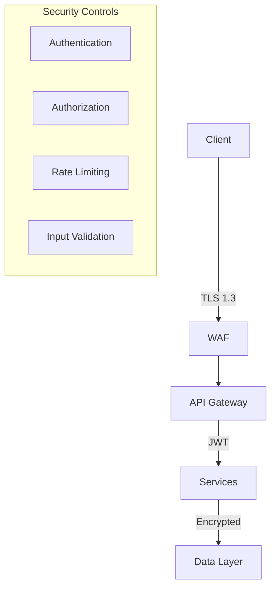

## 2.5 Deployment Architecture

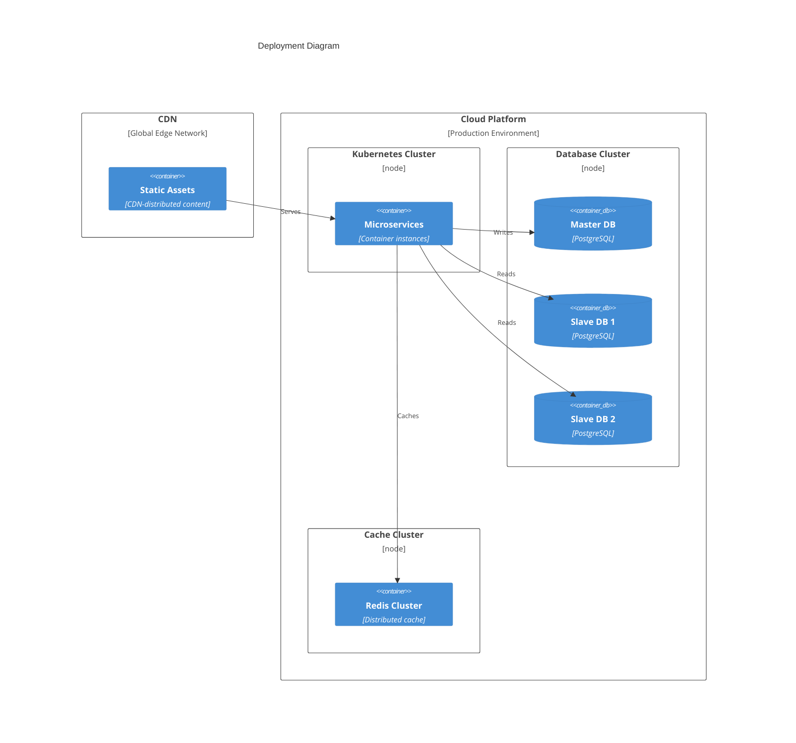

# 3. SYSTEM COMPONENTS ARCHITECTURE

## 3.1 USER INTERFACE DESIGN

### 3.1.1 Design Specifications

| Category | Requirements |
|----------|--------------|
| Visual Hierarchy | - F-pattern layout for content organization<br>- Z-pattern for landing pages<br>- Maximum 3 levels of information hierarchy |
| Design System | - Material Design 3 implementation<br>- Custom component library with atomic design principles<br>- Consistent 8px grid system |
| Responsive Design | - Mobile-first approach<br>- Breakpoints: 320px, 768px, 1024px, 1440px<br>- Fluid typography scaling |
| Accessibility | - WCAG 2.1 Level AA compliance<br>- ARIA landmarks and labels<br>- Keyboard navigation support |
| Browser Support | - Chrome (last 2 versions)<br>- Firefox (last 2 versions)<br>- Safari (last 2 versions)<br>- Edge (last 2 versions) |
| Theme Support | - System-default theme detection<br>- Manual theme toggle<br>- Persistent theme preference storage |
| Internationalization | - RTL layout support<br>- Unicode character handling<br>- Date/time localization<br>- Number formatting |

### 3.1.2 Interface Elements

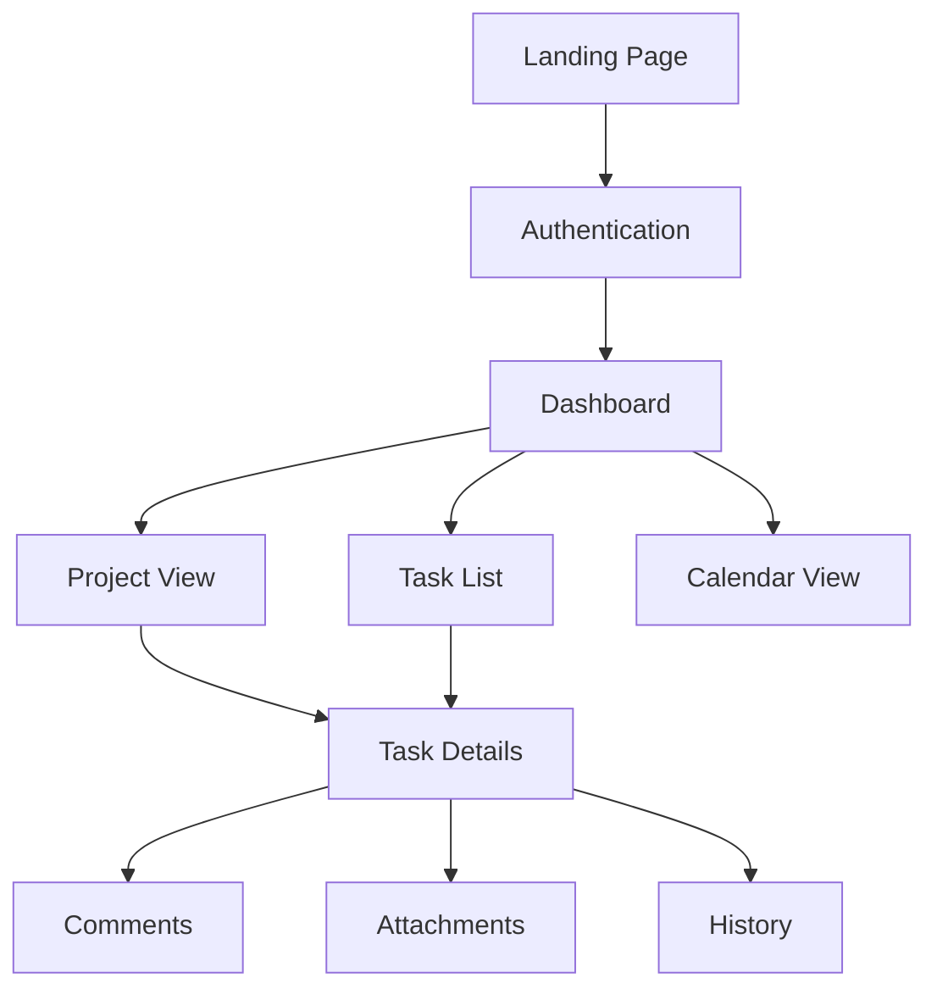

### 3.1.3 Critical User Flows

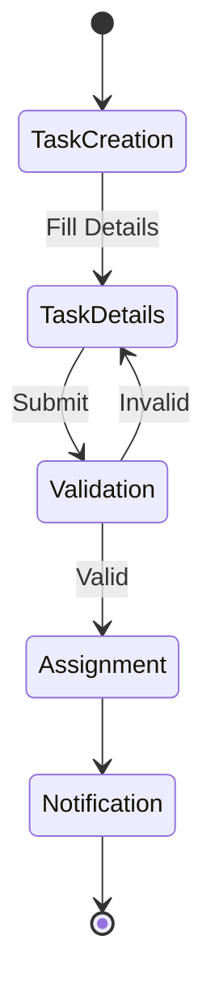

## 3.2 DATABASE DESIGN

### 3.2.1 Schema Design

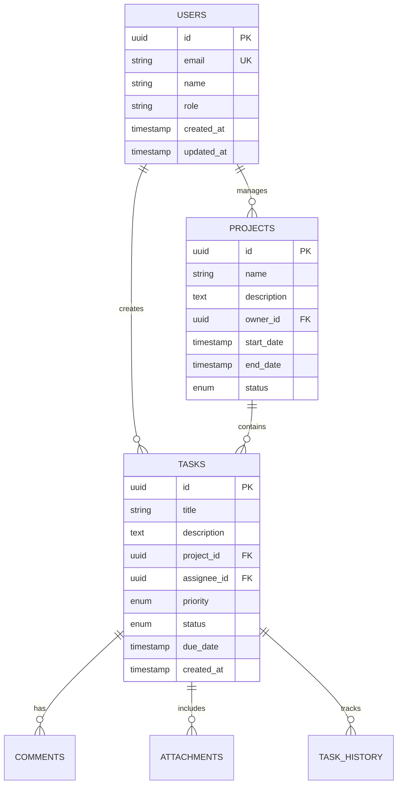

### 3.2.2 Data Management Strategy

| Aspect | Implementation |
|--------|----------------|
| Partitioning | - Project-based horizontal partitioning<br>- Time-based partitioning for historical data |
| Indexing | - B-tree indexes for primary keys<br>- GiST indexes for text search<br>- Partial indexes for active records |
| Archival | - Automated archival after 1 year inactivity<br>- Compressed storage for archived data<br>- Queryable archive tables |
| Backup | - Daily full backups<br>- Hourly incremental backups<br>- 30-day retention period |
| Audit Logging | - Temporal tables for change tracking<br>- Separate audit schema<br>- Immutable audit records |

## 3.3 API DESIGN

### 3.3.1 API Architecture

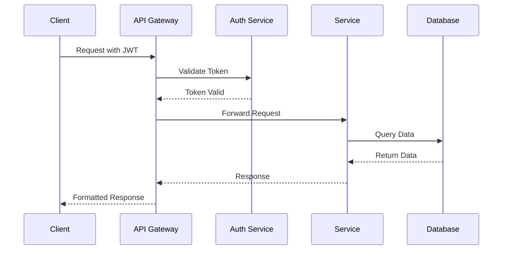

### 3.3.2 Interface Specifications

| Endpoint Category | Specifications |
|------------------|----------------|
| Authentication | - OAuth 2.0 with PKCE<br>- JWT tokens with 1-hour expiry<br>- Refresh token rotation |
| Resource Endpoints | - RESTful design<br>- Nested resources max 2 levels<br>- Bulk operations support |
| Request Limits | - 1000 requests per hour per user<br>- 5MB max request size<br>- 100 items per page default |
| Response Format | - HAL+JSON format<br>- Gzip compression<br>- ETags for caching |
| Error Handling | - RFC 7807 problem details<br>- Consistent error structure<br>- Detailed validation errors |

### 3.3.3 Integration Patterns

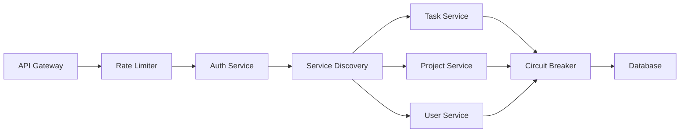

# 4. TECHNOLOGY STACK

## 4.1 PROGRAMMING LANGUAGES

| Platform | Language | Version | Justification |
|----------|----------|---------|---------------|
| Frontend | TypeScript | 5.0+ | - Strong typing for large-scale applications<br>- Enhanced IDE support<br>- Better maintainability |
| Backend | Node.js | 20 LTS | - Excellent async processing<br>- Large ecosystem<br>- JavaScript full-stack alignment |
| Database Scripts | SQL | PostgreSQL 14+ | - Complex query requirements<br>- Data integrity needs |
| DevOps | Python | 3.11+ | - Automation scripting<br>- Infrastructure management |

## 4.2 FRAMEWORKS & LIBRARIES

### 4.2.1 Frontend Framework Stack

| Component | Technology | Version | Purpose |
|-----------|------------|---------|----------|
| Core Framework | React | 18.2+ | - Component-based architecture<br>- Virtual DOM performance<br>- Extensive ecosystem |
| State Management | Redux Toolkit | 1.9+ | - Predictable state updates<br>- DevTools integration |
| UI Components | Material-UI | 5.14+ | - Design system compliance<br>- Accessibility support |
| Form Handling | React Hook Form | 7.45+ | - Performance optimization<br>- Form validation |
| API Client | Axios | 1.4+ | - Request/response interceptors<br>- Progress tracking |

### 4.2.2 Backend Framework Stack

| Component | Technology | Version | Purpose |
|-----------|------------|---------|----------|
| Core Framework | Express.js | 4.18+ | - REST API support<br>- Middleware ecosystem |
| API Documentation | Swagger/OpenAPI | 3.0 | - API specification<br>- Interactive documentation |
| Validation | Joi | 17+ | - Request validation<br>- Type checking |
| ORM | Prisma | 5.0+ | - Type-safe database access<br>- Migration management |

## 4.3 DATABASES & STORAGE

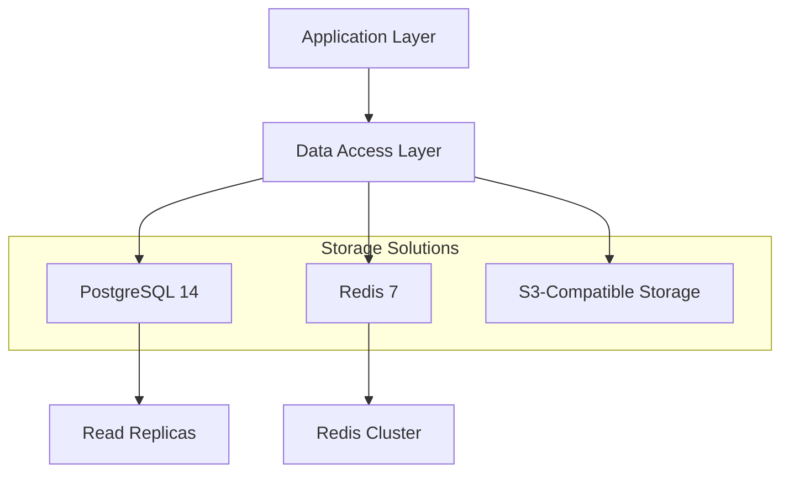

### 4.3.1 Database Solutions

| Type | Technology | Purpose |
|------|------------|---------|
| Primary Database | PostgreSQL 14 | - Structured data storage<br>- ACID compliance<br>- Complex queries |
| Cache Layer | Redis 7 | - Session management<br>- Real-time data<br>- Rate limiting |
| Search Engine | Elasticsearch 8 | - Full-text search<br>- Analytics |
| File Storage | S3-Compatible | - Document storage<br>- Media files |

## 4.4 THIRD-PARTY SERVICES

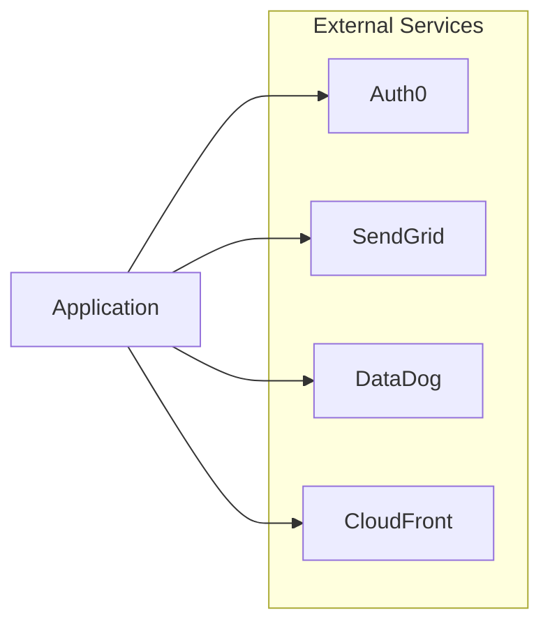

| Service Type | Provider | Purpose |
|--------------|----------|----------|
| Authentication | Auth0 | - SSO integration<br>- Identity management |
| Email | SendGrid | - Transactional emails<br>- Email templates |
| Monitoring | DataDog | - Application monitoring<br>- Log aggregation |
| CDN | CloudFront | - Static asset delivery<br>- DDoS protection |

## 4.5 DEVELOPMENT & DEPLOYMENT

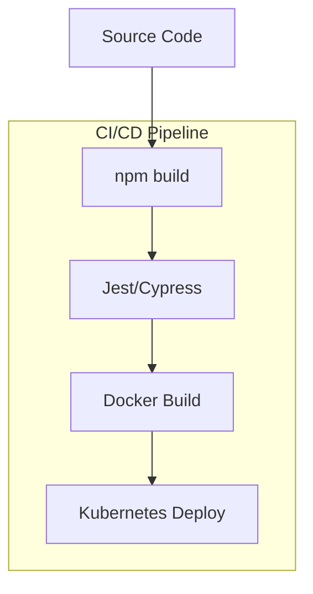

### 4.5.1 Development Tools

| Category | Tools | Purpose |
|----------|-------|---------|
| IDE | VS Code | - Development environment<br>- Extensions support |
| Version Control | Git/GitHub | - Source control<br>- Code review |
| Package Management | npm/yarn | - Dependency management |
| Testing | Jest, Cypress | - Unit/Integration testing |

### 4.5.2 Deployment Infrastructure

| Component | Technology | Purpose |
|-----------|------------|---------|
| Containerization | Docker | - Application packaging<br>- Environment consistency |
| Orchestration | Kubernetes | - Container orchestration<br>- Auto-scaling |
| Infrastructure | Terraform | - Infrastructure as code<br>- Environment provisioning |
| CI/CD | GitHub Actions | - Automated pipeline<br>- Deployment automation |

# 5. SYSTEM DESIGN

## 5.1 USER INTERFACE DESIGN

### 5.1.1 Layout Structure

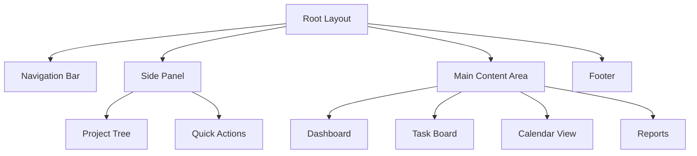

### 5.1.2 Component Specifications

| Component | Description | Interactions |
|-----------|-------------|--------------|
| Navigation Bar | Fixed top bar with global actions | - User profile menu<br>- Notifications<br>- Global search<br>- Help menu |
| Side Panel | Collapsible left panel (320px width) | - Project navigation<br>- Quick task creation<br>- Favorites access |
| Main Content | Responsive container (min-width: 768px) | - Dynamic content area<br>- Multiple view options<br>- Infinite scroll support |
| Task Board | Kanban-style board with draggable cards | - Drag-and-drop tasks<br>- Column customization<br>- Quick edit actions |

### 5.1.3 Responsive Breakpoints

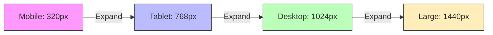

## 5.2 DATABASE DESIGN

### 5.2.1 Schema Overview

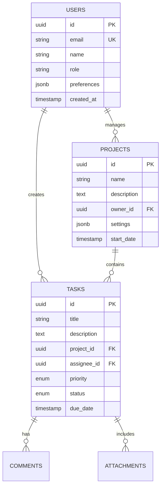

### 5.2.2 Data Storage Strategy

| Storage Type | Purpose | Implementation |
|--------------|---------|----------------|
| Primary Data | Core business data | PostgreSQL with partitioning |
| Cache Layer | Performance optimization | Redis cluster |
| File Storage | Document attachments | S3-compatible object storage |
| Search Index | Full-text search | Elasticsearch |

## 5.3 API DESIGN

### 5.3.1 API Architecture

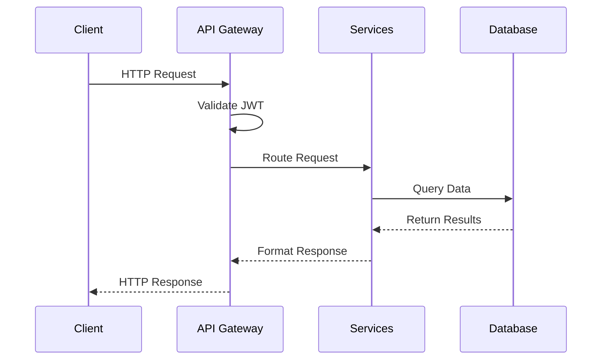

### 5.3.2 Endpoint Structure

| Resource | Method | Endpoint | Purpose |
|----------|--------|----------|----------|
| Tasks | GET | /api/v1/tasks | List tasks |
| Tasks | POST | /api/v1/tasks | Create task |
| Tasks | PUT | /api/v1/tasks/{id} | Update task |
| Projects | GET | /api/v1/projects | List projects |
| Projects | POST | /api/v1/projects | Create project |
| Users | GET | /api/v1/users | List users |

### 5.3.3 Real-time Communication

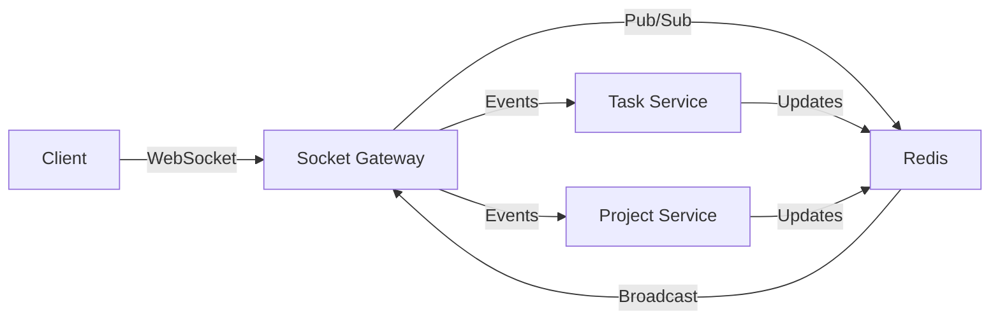

### 5.3.4 API Security

| Security Layer | Implementation |
|----------------|----------------|
| Authentication | JWT with refresh tokens |
| Authorization | RBAC with scope validation |
| Rate Limiting | Redis-based, 1000 req/hour |
| Input Validation | JSON Schema validation |
| Error Handling | RFC 7807 problem details |

# 6. USER INTERFACE DESIGN

## 6.1 Interface Components Key

```
NAVIGATION & ACTIONS
[#] - Dashboard/Menu
[@] - User Profile
[=] - Settings
[+] - Add/Create New
[x] - Close/Delete
[<] [>] - Navigation
[^] - Upload
[*] - Favorite/Star
[?] - Help
[!] - Alert/Warning

INPUT ELEMENTS
[...] - Text Input
[ ] - Checkbox
( ) - Radio Button
[v] - Dropdown Menu
[Button] - Action Button
[====] - Progress Bar

CONTAINERS
+--+ - Container Border
|  | - Container Wall
+-- - Hierarchy/Tree View
```

## 6.2 Main Dashboard Layout

```
+--------------------------------------------------------------------------------+
|  [#] Task Manager                                    [@] Profile  [?] Help  [=]  |
+--------------------------------------------------------------------------------+
|        |                                                                        |
| +------+                                                                        |
| | PROJECTS                     +----------------------------------------+       |
| | +-- Project A               | My Tasks                          [+] New Task  |
| | |   +-- Sprint 1           |                                              |   |
| | |   +-- Sprint 2           | [ ] Task 1                                  |   |
| | +-- Project B              | Due: Today                        [*] [x]   |   |
| |     +-- Planning           |                                              |   |
| |     +-- Development        | [ ] Task 2                                  |   |
| |                           | Due: Tomorrow                      [*] [x]   |   |
| | FILTERS                    |                                              |   |
| | [ ] My Tasks              | [====] 2/5 Tasks Completed                   |   |
| | [ ] Assigned to Me        |                                              |   |
| | [ ] Starred               +----------------------------------------+     |   |
| |                           |                                              |   |
| | LABELS                    | Recent Activity                             |   |
| | [ ] High Priority         | [!] Task 3 updated by John                  |   |
| | [ ] In Progress           | [@] Sarah commented on Task 2               |   |
| | [ ] Blocked               | [+] New task created by Mike                |   |
| +------------------------+  +----------------------------------------+     |   |
+--------------------------------------------------------------------------------+
```

## 6.3 Task Creation Form

```
+--------------------------------------------------------------------------------+
|  Create New Task                                                          [x]    |
+--------------------------------------------------------------------------------+
|                                                                                 |
|  Title:     [......................................................]           |
|                                                                                 |
|  Project:   [v] Project A                                                      |
|                                                                                 |
|  Assignee:  [v] Select Team Member                                             |
|                                                                                 |
|  Due Date:  [.......] [v] Time                                                 |
|                                                                                 |
|  Priority:  ( ) Low  ( ) Medium  (•) High                                      |
|                                                                                 |
|  Description:                                                                   |
|  +------------------------------------------------------------------+        |
|  |                                                                    |        |
|  |                                                                    |        |
|  +------------------------------------------------------------------+        |
|                                                                                 |
|  Attachments: [^ Upload Files]                                                 |
|                                                                                 |
|  [ ] Send notifications to team                                                 |
|                                                                                 |
|            [Cancel]                                     [Create Task]           |
|                                                                                 |
+--------------------------------------------------------------------------------+
```

## 6.4 Task Detail View

```
+--------------------------------------------------------------------------------+
|  Task Details: TK-123                                                    [x]     |
+--------------------------------------------------------------------------------+
|                                                                                 |
| Title: Implementation of User Authentication                                    |
| Status: [v] In Progress                Priority: [*] High                      |
|                                                                                 |
| Assignee: [@] Sarah Parker             Due: Oct 21, 2023 5:00 PM              |
|                                                                                 |
| Description:                                                                    |
| +------------------------------------------------------------------+         |
| | Implement OAuth 2.0 authentication flow with support for:           |         |
| | - Google SSO                                                       |         |
| | - Microsoft Azure AD                                              |         |
| | - Email/Password fallback                                         |         |
| +------------------------------------------------------------------+         |
|                                                                                 |
| Attachments:                                                                   |
| +------------------------------------------------------------------+         |
| | [^] auth-flow-diagram.pdf                                          |         |
| | [^] technical-requirements.docx                                    |         |
| +------------------------------------------------------------------+         |
|                                                                                 |
| Comments:                                                                      |
| +------------------------------------------------------------------+         |
| | [@] John: Added Azure AD configuration documentation               |         |
| | [@] Sarah: Testing OAuth flow with Google - found some issues     |         |
| |                                                                    |         |
| | [......................................................]          |         |
| | [Add Comment]                                                     |         |
| +------------------------------------------------------------------+         |
|                                                                                 |
|            [Update Task]                                [Close Task]           |
|                                                                                 |
+--------------------------------------------------------------------------------+
```

## 6.5 Project Timeline View

```
+--------------------------------------------------------------------------------+
|  Project Timeline: Project A                                     [Export] [=]    |
+--------------------------------------------------------------------------------+
|                                                                                 |
| Oct 2023        Nov 2023         Dec 2023         Jan 2024                     |
| +------------+--+------------+----+-----------+----+-----------+                |
| |[====] Task 1  |                |                |           |                |
| |     Task 2    [==========]     |                |           |                |
| |          Task 3     [====]     |                |           |                |
| |               |    Task 4      [========]       |           |                |
| |               |         Task 5 [==============] |           |                |
| +------------+--+------------+----+-----------+----+-----------+                |
|                                                                                 |
| LEGEND:                                                                        |
| [====] Completed                                                               |
| [====] In Progress                                                             |
| [....]  Planned                                                               |
|                                                                                 |
| Filter: [v] All Tasks    Group By: [v] Assignee    View: [v] Timeline         |
|                                                                                 |
+--------------------------------------------------------------------------------+
```

## 6.6 Responsive Design Breakpoints

| Breakpoint | Width | Layout Adjustments |
|------------|-------|-------------------|
| Mobile | 320px - 767px | - Single column layout<br>- Collapsible sidebar<br>- Stacked task cards<br>- Simplified timeline view |
| Tablet | 768px - 1023px | - Two column layout<br>- Mini sidebar<br>- Grid task cards<br>- Scrollable timeline |
| Desktop | 1024px+ | - Full three column layout<br>- Expanded sidebar<br>- Kanban board view<br>- Full timeline view |

## 6.7 Component Specifications

| Component | Framework Implementation | Behavior |
|-----------|------------------------|-----------|
| Navigation Bar | Material-UI AppBar | - Fixed position<br>- Responsive menu<br>- Search integration |
| Task Cards | Material-UI Card | - Drag and drop support<br>- Expandable details<br>- Loading states |
| Forms | React Hook Form | - Real-time validation<br>- Auto-save drafts<br>- Error handling |
| Timeline | Custom Component | - Horizontal scrolling<br>- Zoom levels<br>- Date range selection |

# 7. SECURITY CONSIDERATIONS

## 7.1 AUTHENTICATION AND AUTHORIZATION

### 7.1.1 Authentication Flow

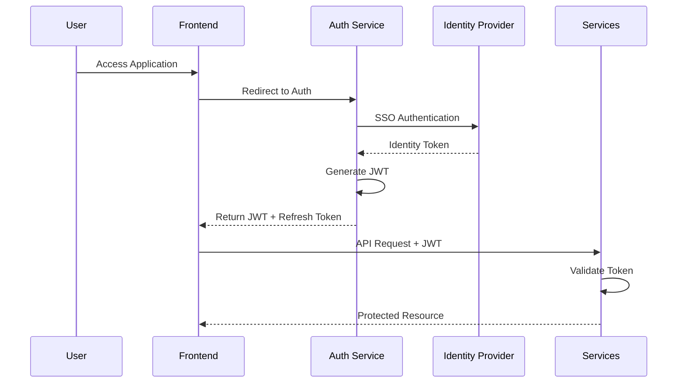

### 7.1.2 Authentication Methods

| Method | Implementation | Purpose |
|--------|---------------|----------|
| SSO | Auth0/OIDC | Enterprise identity integration |
| MFA | TOTP/SMS | Additional security layer |
| Password | Argon2id hashing | Local authentication fallback |
| API Keys | SHA-256 hashed | Service-to-service auth |
| Session | Redis-based | Web session management |

### 7.1.3 Authorization Matrix

| Role | Task Operations | Project Operations | User Operations | System Operations |
|------|----------------|-------------------|-----------------|-------------------|
| Admin | Full Access | Full Access | Full Access | Full Access |
| Project Manager | Create, Read, Update, Delete | Create, Read, Update | Read, Update | Read |
| Team Lead | Create, Read, Update | Read, Update | Read | None |
| Team Member | Create, Read, Update | Read | Read | None |
| Viewer | Read | Read | None | None |

## 7.2 DATA SECURITY

### 7.2.1 Encryption Standards

| Data State | Method | Key Management |
|------------|--------|----------------|
| In Transit | TLS 1.3 | Automated rotation (90 days) |
| At Rest | AES-256-GCM | HSM-based key storage |
| In Memory | Secure heap allocation | Runtime encryption |
| Backups | AES-256-CBC | Offline master key |

### 7.2.2 Data Classification

```mermaid
flowchart TD
    A[Data Input] --> B{Classification}
    B -->|PII| C[Restricted]
    B -->|Financial| D[Confidential]
    B -->|Internal| E[Private]
    B -->|Public| F[Public]
    
    C --> G[Encryption Required]
    D --> G
    E --> H[Access Control]
    F --> I[No Restrictions]
```

### 7.2.3 Data Protection Measures

| Protection Type | Implementation | Monitoring |
|----------------|----------------|------------|
| Access Control | Row-Level Security in PostgreSQL | Audit Logging |
| Field Encryption | Application-level encryption | Key Usage Metrics |
| Data Masking | Dynamic masking for PII | Access Patterns |
| Secure Deletion | Soft delete with encryption | Deletion Audit |

## 7.3 SECURITY PROTOCOLS

### 7.3.1 Network Security

```mermaid
flowchart LR
    A[Internet] -->|TLS| B[WAF]
    B -->|Filter| C[Load Balancer]
    C -->|Internal| D[API Gateway]
    D -->|mTLS| E[Services]
    E -->|Encrypted| F[Databases]
```

### 7.3.2 Security Controls

| Control Type | Implementation | Update Frequency |
|--------------|----------------|------------------|
| WAF Rules | ModSecurity with Custom Rules | Weekly |
| Rate Limiting | Redis-based, per IP/user | Real-time |
| Input Validation | JSON Schema Validation | Per Deployment |
| Output Encoding | Context-based encoding | Continuous |
| CORS Policy | Whitelist-based | Per Environment |

### 7.3.3 Security Monitoring

| Component | Tool | Alert Threshold |
|-----------|------|-----------------|
| Intrusion Detection | Wazuh | Real-time |
| Vulnerability Scanning | Nessus | Weekly |
| Dependency Scanning | Snyk | Per Commit |
| Log Analysis | ELK Stack | Real-time |
| Performance Monitoring | DataDog | 5-minute intervals |

### 7.3.4 Incident Response

```mermaid
stateDiagram-v2
    [*] --> Detection
    Detection --> Analysis
    Analysis --> Containment
    Containment --> Eradication
    Eradication --> Recovery
    Recovery --> PostIncident
    PostIncident --> [*]
```

### 7.3.5 Compliance Requirements

| Requirement | Standard | Implementation |
|-------------|----------|----------------|
| Data Privacy | GDPR/CCPA | Data classification, encryption |
| Access Control | ISO 27001 | RBAC, MFA |
| Audit Logging | SOC 2 | Immutable audit trails |
| Data Retention | Industry-specific | Automated archival policies |
| Security Testing | OWASP Top 10 | Regular penetration testing |

# 8. INFRASTRUCTURE

## 8.1 DEPLOYMENT ENVIRONMENT

```mermaid
flowchart TD
    A[Production Environment] --> B[Primary Region]
    A --> C[Secondary Region]
    B --> D[Kubernetes Cluster]
    B --> E[Database Cluster]
    B --> F[Cache Cluster]
    C --> G[Failover Cluster]
    C --> H[Backup Systems]
    C --> I[DR Services]
```

| Environment | Configuration | Purpose |
|-------------|--------------|----------|
| Production | Multi-region cloud deployment | Primary system operation |
| Staging | Single-region replication | Pre-release testing |
| QA | Scaled-down environment | Testing and validation |
| Development | Local/cloud hybrid | Development and debugging |

### Infrastructure Requirements

| Component | Specification | Scaling Strategy |
|-----------|--------------|------------------|
| Compute | 32 vCPU, 64GB RAM per node | Horizontal auto-scaling |
| Storage | SSD-backed persistent storage | Dynamic provisioning |
| Network | 10Gbps dedicated bandwidth | Load-balanced distribution |
| Memory | 256GB Redis cluster | Distributed caching |

## 8.2 CLOUD SERVICES

| Service Category | Provider | Service Name | Purpose |
|-----------------|----------|--------------|----------|
| Compute | AWS | EKS | Kubernetes management |
| Database | AWS | RDS for PostgreSQL | Primary data storage |
| Cache | AWS | ElastiCache | Redis cluster management |
| Storage | AWS | S3 | File storage and backups |
| CDN | AWS | CloudFront | Static content delivery |
| DNS | AWS | Route 53 | DNS management and routing |
| Monitoring | AWS | CloudWatch | System monitoring and alerts |
| Security | AWS | WAF & Shield | DDoS protection |

## 8.3 CONTAINERIZATION

```mermaid
flowchart LR
    A[Source Code] --> B[Docker Build]
    B --> C[Container Registry]
    C --> D[Development]
    C --> E[Staging]
    C --> F[Production]
    
    subgraph Container Images
    G[Frontend: Node.js]
    H[Backend: Node.js]
    I[Cache: Redis]
    J[Queue: RabbitMQ]
    end
```

### Container Specifications

| Service | Base Image | Resource Limits |
|---------|------------|-----------------|
| Frontend | node:20-alpine | CPU: 2, Memory: 4GB |
| Backend | node:20-alpine | CPU: 4, Memory: 8GB |
| Cache | redis:7-alpine | CPU: 2, Memory: 8GB |
| Queue | rabbitmq:3.12-management | CPU: 2, Memory: 4GB |

## 8.4 ORCHESTRATION

```mermaid
flowchart TD
    A[Kubernetes Cluster] --> B[Node Pool 1]
    A --> C[Node Pool 2]
    A --> D[Node Pool 3]
    
    B --> E[Frontend Pods]
    C --> F[Backend Pods]
    D --> G[Database Pods]
    
    H[Ingress Controller] --> E
    H --> F
```

### Kubernetes Configuration

| Component | Configuration | Scaling Rules |
|-----------|--------------|---------------|
| Node Pools | 3-5 nodes per pool | CPU > 70% triggers scale-out |
| Pod Autoscaling | Min: 3, Max: 20 pods | Memory > 80% triggers scale-out |
| Network Policy | Calico CNI | Isolated namespaces |
| Storage Class | AWS EBS gp3 | Dynamic provisioning |

## 8.5 CI/CD PIPELINE

```mermaid
flowchart LR
    A[Source Code] --> B[Build]
    B --> C[Test]
    C --> D[Security Scan]
    D --> E[Container Build]
    E --> F[Registry Push]
    F --> G[Deploy Staging]
    G --> H[Integration Tests]
    H --> I[Deploy Production]
    
    subgraph Automated Checks
    J[Unit Tests]
    K[Linting]
    L[SAST]
    M[Container Scan]
    end
```

### Pipeline Stages

| Stage | Tools | Actions |
|-------|-------|---------|
| Source Control | GitHub | Code versioning, branch protection |
| Build | GitHub Actions | Code compilation, dependency resolution |
| Test | Jest, Cypress | Unit tests, integration tests |
| Security | SonarQube, Snyk | Code analysis, vulnerability scanning |
| Artifact | AWS ECR | Container image storage |
| Deployment | ArgoCD | Kubernetes deployment management |
| Monitoring | Prometheus, Grafana | Performance monitoring, alerts |

### Deployment Strategy

| Environment | Strategy | Rollback Time |
|-------------|----------|---------------|
| Production | Blue-Green | < 5 minutes |
| Staging | Rolling Update | < 2 minutes |
| Development | Direct Update | Immediate |

# 9. APPENDICES

## 9.1 ADDITIONAL TECHNICAL INFORMATION

### 9.1.1 Browser Support Matrix

| Browser | Minimum Version | Notes |
|---------|----------------|--------|
| Chrome | 90+ | Full feature support |
| Firefox | 88+ | Full feature support |
| Safari | 14+ | Limited WebSocket reconnection |
| Edge | 90+ | Full feature support |
| Mobile Chrome | 90+ | Touch optimization required |
| Mobile Safari | 14+ | PWA installation supported |

### 9.1.2 Performance Benchmarks

```mermaid
gantt
    title Response Time Targets
    dateFormat X
    axisFormat %s
    
    section API Calls
    CRUD Operations :0, 500ms
    File Upload    :0, 30s
    Search Query   :0, 800ms
    
    section Page Load
    Initial Load   :0, 3s
    Subsequent     :0, 1s
    Asset Loading  :0, 2s
```

### 9.1.3 Error Code Reference

| Code Range | Category | Example |
|------------|----------|---------|
| 1000-1999 | Authentication | 1001: Invalid credentials |
| 2000-2999 | Task Operations | 2001: Task not found |
| 3000-3999 | Project Operations | 3001: Invalid project status |
| 4000-4999 | File Operations | 4001: File size exceeded |
| 5000-5999 | System Errors | 5001: Database connection failed |

## 9.2 GLOSSARY

| Term | Definition |
|------|------------|
| Artifact | Any file or document attached to a task or project |
| Burndown Chart | Visual representation of work left to do versus time |
| Critical Path | Sequence of dependent tasks determining project completion |
| Epic | Large body of work that can be broken down into smaller tasks |
| Gantt Chart | Bar chart showing project schedule with dependencies |
| Iteration | Fixed time period for completing a set of tasks |
| Story Points | Measure of effort required to implement a user story |
| Velocity | Measure of team's productivity over time |
| Waterfall | Sequential project management approach |
| Work Breakdown Structure | Hierarchical decomposition of project work |

## 9.3 ACRONYMS

| Acronym | Full Form |
|---------|-----------|
| ACID | Atomicity, Consistency, Isolation, Durability |
| API | Application Programming Interface |
| CDN | Content Delivery Network |
| CORS | Cross-Origin Resource Sharing |
| CRUD | Create, Read, Update, Delete |
| DDD | Domain-Driven Design |
| DNS | Domain Name System |
| ETL | Extract, Transform, Load |
| GZIP | GNU ZIP |
| HSM | Hardware Security Module |
| HTTPS | Hypertext Transfer Protocol Secure |
| JSON | JavaScript Object Notation |
| JWT | JSON Web Token |
| MFA | Multi-Factor Authentication |
| MIME | Multipurpose Internet Mail Extensions |
| OAuth | Open Authorization |
| OIDC | OpenID Connect |
| REST | Representational State Transfer |
| SDK | Software Development Kit |
| SQL | Structured Query Language |
| SSL | Secure Sockets Layer |
| TCP | Transmission Control Protocol |
| TLS | Transport Layer Security |
| URI | Uniform Resource Identifier |
| URL | Uniform Resource Locator |
| UUID | Universally Unique Identifier |
| WAF | Web Application Firewall |
| XSS | Cross-Site Scripting |
| YAML | YAML Ain't Markup Language |